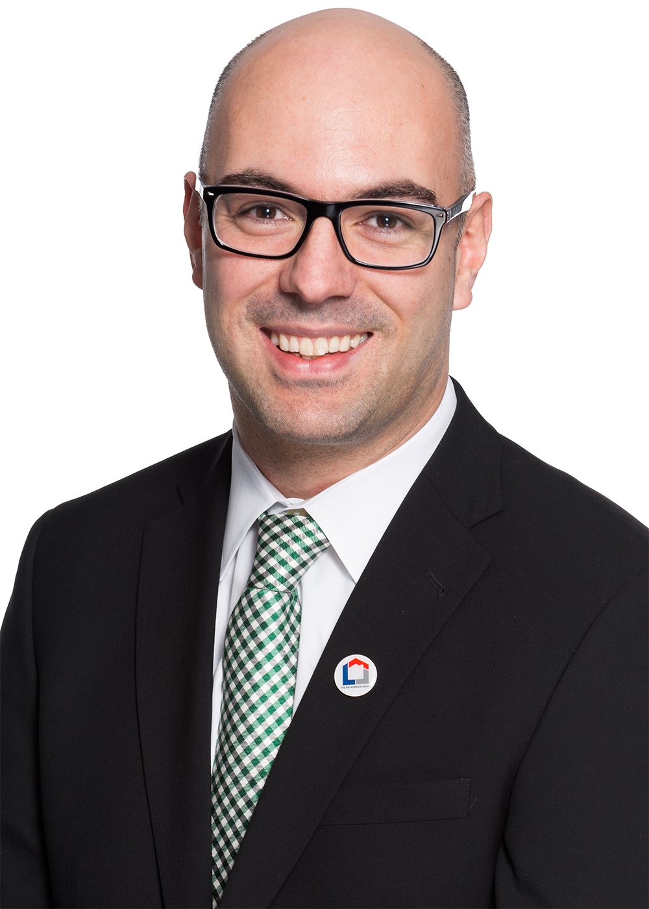

# Rodrigo Pinto, CPA, CA
## Chief Financial Officer (CFO)

Rodrigo Pinto joined TNG as the CFO in October 2015 where he has led the finance and accounting departments. He plays a key role in developing our strategy, and establishing our governance, tax planning, and budgeting as we go through a period of change and rapid growth domestically and in international markets.
Rodrigo brings with him over 16 years of finance and accounting knowledge and international experience with several multinational corporations in Brazil, the United States, and Canada including PricewaterhouseCoopers, Fannie Mae, and TD Bank. His most recent tenure was in the capacity of CFO and VP of Finance at MBAC Fertilizer Corp.
He is a Chartered Accountant, a Certified Public Accountant in the United States, and holds the equivalent of a CPA designation in Brazil.

